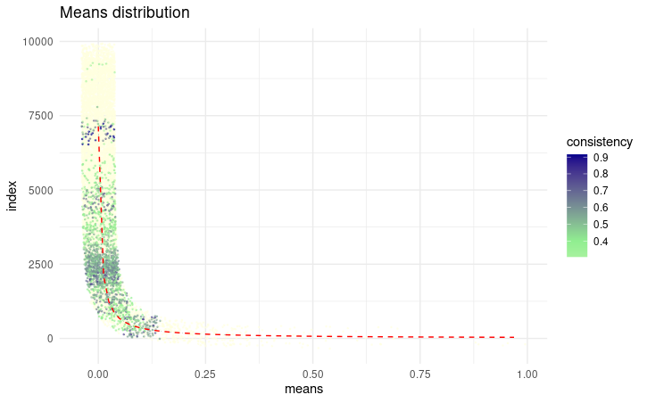
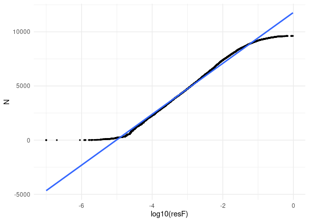
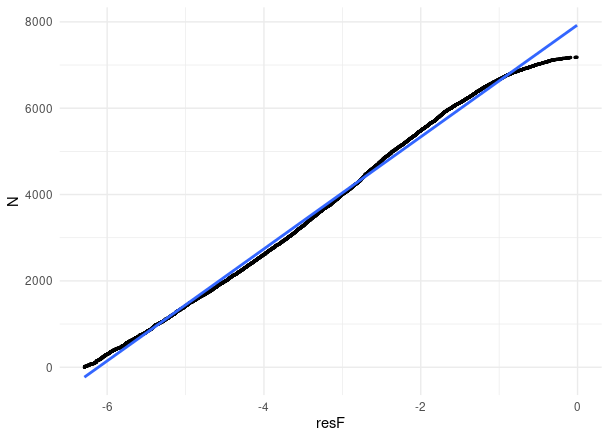
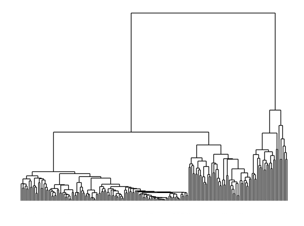
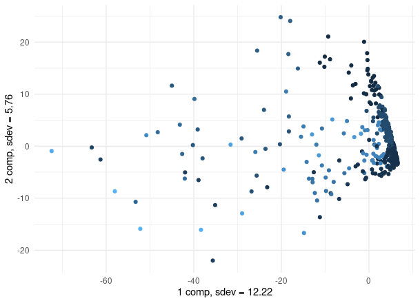

# samova.R: benchmarking <a href=""></a> 
### Vignette for automatic benchmarking of taxonomy annotation tools

Diffrent metagenomics tools produce different results. If most of them can produce some metrics for evaluation of their results, different WGS annotators can not. Most evaluations are based on indirected metrics: unclassified an "noizy" taxa abundance, while overall classification quality should be based on accuracy of taxa assignment. 

Follow general steps or see vignette from example

## Installation

For the benchmarking, you need to install: samovaR for artificial abundance tables generation, InSilicoSeq to generate raw .fastq metagenomics data based on fasterq-dump obtained genomes:

```bash
git clone https://github.com/dsmutin/samovar.git
```

In your R session, source all functions:
```R
source(PATH/TO/SAMOVAR/scripts/source.R)
```


## Usage


### Demo version
Demo is now avialable at /demo repository. To run it, install it and run demo.R


### R interface
To use samovaR in R environment, use R_samova.R
Documentation is avialable below. Main idea is to use this functions chain:
```R
source("PATH_TO_SAMOVAR/scripts/source.R")
tea <- GMrepo_type2data(test = T)[[1]] %>% res_normalize %>% build_samovar %>% boil
```

### Command line interface
Now samovar could be used from command line. 
To run and build samovar, use SH_samova.R:
```
---  BASH interface of samova.R  ---

Usage example:
Rscript samova.R --test --drop_unclassified > samovar.log

Options:
--help: show this massage and exit
--test: use test data as input

-n:  number of data to generate. 1 by default
-o:  output csv file
-is: species name to initiate. character from table. most occured by default
-il: species level to initiate. mean of is amount by default
-k:  number of k-means to split the data. 10 by default
-mc: minimal amount of species per cluster. 2 by default

-trA:  treshhold to remove species amounts. 0 by default
-trP:  treshhold to remove species amounts. 2 by default
-nf: normalisation function of x. function(x) log10(x+1) by default
-pref: prefix of column names for new data
-inn: inner model for clusters. gaussian by default
-int: inter model for clusters. gaussian by default
--add:  add novel data to current table
--drop_unclassified: drop all unclassified and unknown levels
--calc_unclassified: calculate unclassified


To be implemented:
-r: runs as input
-d: desease as input
-t: csv data.frame as input
-nP: number of runs to process. only for -r and -d
```


To run test build, use SHamova.R:
```
---  BASH interface of samova.R  ---

Usage example:
Rscript SHamova.R --test -a new_ -n 100 -is Bifidobacterium_asteroides -il 0.002 -o generated.csv

Options:
--help: show this massage and exit
--test: use test data as input

-t:  treshhold to remove species occurances. 0 by default
-a:  add novel data to current table. FALSE by default, or you can specify column name for new lines
-is: species name to initiate. most occured as default
-il: species level to initiate. mean as default
-o:  output

To be implemented:
-r: runs as input
-d: desease as input
-t: csv data.frame as input
-n: number of runs to process. for -r and -d
```

### R usage
If you want to run pipeline without contol on results, you can execute:
```R
new_counts <- data %>% samovaR(...)

# Input:
# data - data.frame;  columns: ncbi taxonIDs, species names, all runIDs; rows: species;
# if you use custom extraction scripts below, it is the data[[1]]

# Parameters:
# prepared - logical. is all data prepared
# reps - number of repeats
# ... - all parameters from precious stages
```


Or follow the pipeline to take full control on process.

#### Get the data from GMrepo. If you want to use your abundance file, skip this stage
```R
data <- GMrepo_type2data(mesh_ids, ...)

#or to use with run list:
data <- GMrepo_run2data(runs, ...)

# Parameters:
# mesh_ids - character, all types ID to use from GMrepo
# runs - character, all runs ID to use from GMrepo
# number_to_process - numeric vector for number of runs per meshID. if not specified, all runs will be downloaded
# experiment_type - character, experiment type to be only downloaded from GMrepo. if not specified, all runs will be downloaded
# test - logical. if true, test data will be executed

# Output
# List:
  # [1] data.frame; columns: ncbi taxonIDs, species names, all runIDs; rows: species; values: percents of all amount in sample, up to 100%
  # [2] data.frame; columns: runID, desease
  # [3] list;
    # [3][runID] for each runID, list of length 16 whith metadeta from GMrepo
```

On this stage, you can split your data into groups and filter it using metadata


To check the distribution and its variations, you can run:
```R
data %>% res_trim (...) %>% plot_data_with_treshhold()
data %>% res_trim (...) %>% plot_data_n2amount(normalisation_function = log10)

#you can use for test and similar data:
data %>% res_trim (...) %>% plot_data_n2amount(normalisation_function = function(x) log10(1/(1-log10(x)))*(1-2*log10(x)))

# Parameters:
# res_trim:
  # treshhold_amount - numeric, from 0 to 1. minimal mean amount in samples to use in pipeline
  # treshhold_presence - numeric, from 0 to number of reads. minimal number of samples to use in pipeline
# plots:
  # normalisation_function - function(x), to normalise data
  # split_n - amount to highlight on plot
```


Distribution plot

Log10 and custom normalisation results

#### Normalize data distribution and apply treshholds:
```R
data <- data %>% res_trim (treshhold_amount = 10^(-4))
data_scaled <- data %>% res_normalize(normalisation_function = function(x) log10(1/(1-log10(x)))*(1-2*log10(x)) )

# Parameters:
# res_trim:
  # treshhold_amount - numeric, from 0 to 1. minimal mean amount in samples to use in pipeline
  # treshhold_presence - numeric, from 0 to number of reads. minimal number of samples to use in pipeline
# res_normalize
  # normalisation_function - function(x), to normalize data. log by default

# Reverse function of this operation is res_unscale(X, data, data_scaled) and takes: data_scaled(X) -> data(X)
```

Visualize and determine number of k-means to split the initial matrix. Should work faster for bigger k-means values, but extrime numbers results in loss of complexity
```R
data_scaled %>% res_cluster_dendro
data_scaled %>% res_cluster_PCA2D

# Parameters:
# k_means - numeric, number of k-means to use
# speices - logical, by default true. if false, distribution of runs will be shown
```


Clusterisation and PCA results. On PCA, each colour is for different cluster

#### Create coherence tables
```R
samovar <- data_scaled %>% build_samovar(...)

# Input:
# data_scaled: scaled data frame; columns, samples; rows, species; 

# Parameters:
# k_means - numeric, number of k-means to use
# inner_model - character, type of global linear model to use in calculation for species cluster, processed by glm(). gaussian by default
# inter_model - character, type of global linear model to use in calculation between species clusters, processed by glm(). gaussian by default
# prepared - logical. set true, if you follow pipeline steps or have a data frame with all values above 0 and normal distribution. false by default. _to be implemented

# Output:
# List:
  # [1] list
    # [1][cluster] for each cluster: matrix of glm R squares of each cluster
      # Now is calculated as:
      # glm(sp1[value > 0] ~ sp2[value > 0], family = inner_model)
  # [2] list
    # [2][cluster] for each cluster: matrix of probabilities of each two samples to co-occure.
      # Now is calculated as:
      # N(cases with both species) / sum(cases with one or two species), e.a. W(a&b)/W(a|b). It is planned to implement Bayesian analise of co-ocurance.
  # [3] matrix of glm R squares between each cluster
      # Now is calculated as:
      # glm(mean(cl1) ~ mean(cl2), family = inter_model). It is planned to implement multidimensional GLM for this calculation.
  # [4] list, parametrs of samovar
```

#### Boil the samovar to get new data
```R
new_reads <- boil(data, data_scaled, samovar, ...)

# Input
# if prepared = true
# data: data.frame; columns, samples; rows, species;
# data_scaled: scaled data.frame; columns, samples; rows, species;
# samovar: list from precious step

# if prepared = false
# data: data.frame; columns, samples; rows, species;

# Parameters:
# prepared - logical. is all data prepared
# reps - number of repeats
# ... - all parameters from precious stages
```

#### Validation
To be implemented. Now can be contoled using corrplot
```R
plot_corr(data, new_reads)
```

### References
- Chechenina А., Vaulin N., Ivanov A., Ulyantsev V. Development of in-silico models of metagenomic communities with given properties and a pipeline for their generation. Bioinformatics Institute 2022/23 URL: https://elibrary.ru/item.asp?id=60029330
- Dai, D. et al. "GMrepo v2: a curated human gut microbiome database with special focus on disease markers and cross-dataset comparison". Nucleic Acids Res (2022). Volume 50, Issue D1, Pages D777–D784.


### Required R packages
- Wickham et al., (2019). Welcome to the tidyverse. Journal of Open Source Software, 4(43), 1686, https://doi.org/10.21105/joss.01686
- Taiyun Wei and Viliam Simko (2021). R package 'corrplot': Visualization of a Correlation Matrix (Version 0.92). Available from https://github.com/taiyun/corrplot
- Simon Garnier, Noam Ross, Robert Rudis, Antônio P. Camargo, Marco Sciaini, and Cédric Scherer (2023). viridis(Lite) - Colorblind-Friendly Color Maps for R. viridis package version 0.6.4.
- C. Sievert. Interactive Web-Based Data Visualization with R, plotly, and shiny. Chapman and Hall/CRC, Florida, 2020.
- de Vries A, Ripley BD (2022). _ggdendro: Create Dendrograms and Tree Diagrams Using 'ggplot2'_. R package version 0.1.23, <https://CRAN.R-project.org/package=ggdendro>.
- Wickham H (2023). _httr: Tools for Working with URLs and HTTP_. R package version 1.4.6, <https://CRAN.R-project.org/package=httr>.
- Ooms J (2014). “The jsonlite Package: A Practical and Consistent Mapping Between JSON Data and R Objects.” _arXiv:1403.2805 [stat.CO]_. <https://arxiv.org/abs/1403.2805>.
- Wickham H, Hester J, Ooms J (2023). _xml2: Parse XML_. R package version 1.3.4, <https://CRAN.R-project.org/package=xml2>.
- Donaldson J (2022). _tsne: T-Distributed Stochastic Neighbor Embedding for R (t-SNE)_. R package version 0.1-3.1, <https://CRAN.R-project.org/package=tsne>.
- Maechler, M., Rousseeuw, P., Struyf, A., Hubert, M., Hornik, K.(2022).  cluster: Cluster Analysis Basics and Extensions. R package version 2.1.4.
- Bates D, Maechler M, Jagan M (2023). _Matrix: Sparse and Dense Matrix Classes and Methods_. R package version 1.6-1.1, <https://CRAN.R-project.org/package=Matrix>.
- Chang W, Cheng J, Allaire J, Sievert C, Schloerke B, Xie Y, Allen J, McPherson J, Dipert A, Borges B (2023). _shiny: Web Application Framework for R_. R package version 1.7.5.1, <https://CRAN.R-project.org/package=shiny>.
