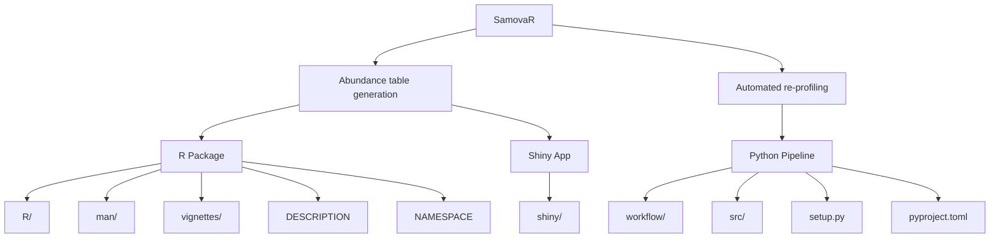
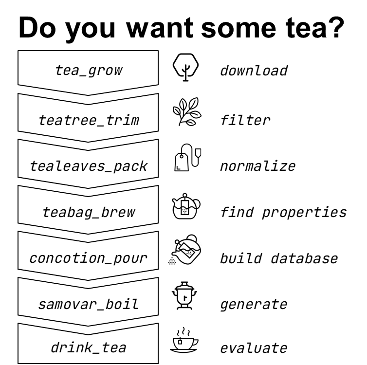

# samova.R v.0.6 <a href=""></a> 
### Artificial metagenome generation and automatic benchmarking

There is a fundamental problem in modern ***metagenomics***: there are huge differences between methodological approaches that strongly influence the results, while remaining outside the attention of researchers. 

The use of golden practice and open code, while allowing data to be analyzed reproducibly, locks scientists into a single, far from perfect approach, with its own bias.

Therefore, we propose an approach that utilizes de novo generation of the artificial metagenomes - `SamovaR`.

## Components

- **R** package `samova.R` for the artificial abundance table generation
- **Python** + **bash** pipeline for the automated benchmarking

## Project Structure



## Usage
Basic usage described in <a href="./vignettes">**vignettes**</a> and <a href="https://github.com/ctlab/samovar/wiki">**wiki**</a>

You can also try the generator with <a href="https://dsmutin.shinyapps.io/samovaR/">**web** shiny app</a>

## Installation

### Quick Installation
The easiest way to install SamovaR is to use our installation script:

```bash
git clone https://github.com/ctlab/samovar
cd samovar
chmod +x install.sh
./install.sh
```

This script will:
1. Detect and use your custom R library path (if set in ~/.Renviron or ~/.Rprofile)
2. Install all R dependencies
3. Install the R package
4. Install all Python dependencies
5. Install the Python package
6. Install Snakemake and InSilicoSeq if not present

The script automatically detects custom R library paths from:
- `~/.Renviron` (R_LIBS environment variable)
- `~/.Rprofile` (libPaths() function)
- Falls back to the default R library path if no custom path is found

### Manual Installation

If you prefer to install components separately:

Install R package:

```r
# If you have a custom library path, specify it:
.libPaths('/path/to/your/R/library')
devtools::install_github("https://github.com/ctlab/samovar/")
```

Install python package:

```bash
git clone https://github.com/ctlab/samovar
cd samovar
pip install -e .
```

## R algorithm summary



## R generation

<a href="https://github.com/ctlab/samovar/samovaR.pdf">See</a> or <a href="vignettes/samovar-basic.Rmd">source</a> a vignette

``` r
library(samovaR)

# download data
teatree <- GMrepo_type2data(number_to_process = 2000)

# filter
tealeaves <- teatree %>%
  teatree_trim(treshhold_species = 3, treshhold_samples = 3, treshhold_amount = 10^(-3))

# normalizing
teabag <- tealeaves %>%
  tealeaves_pack()

# clustering
concotion <- teabag %>%
  teabag_brew(min_cluster_size = 4, max_cluster_size = 6)

# building samovar
samovar <- concotion %>%
  concotion_pour()

# generating new data
new_data <- samovar %>%
  samovar_boil(n = 100)
```

## Documentation
<a src="https://github.com/ctlab/samovar/blob/main/samovaR_man.pdf">Documentation</a> for the **R package**

## Algorithm details


## References
- Chechenina А., Vaulin N., Ivanov A., Ulyantsev V. Development of in-silico models of metagenomic communities with given properties and a pipeline for their generation. Bioinformatics Institute 2022/23 URL: https://elibrary.ru/item.asp?id=60029330


## Dependencies
### R package
- **main**
  - tidyverse
  - cluster
  - scclust
  - Matrix
  - methods
  - here
- **vizualization** 
  - ggplot
  - plotly
  - tsne
  - ggnewscale
- **API**
  - httr
  - jsonlite
  - xml2


### Automated benchmarking
- **R packages**
- snakemake
- InSilicoSeq
- **python packages**
  - rpy2
  - nump
  - pandas
  - requests
  - ete3
