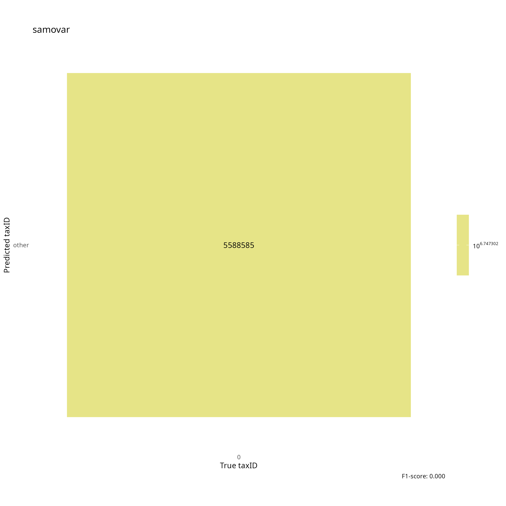
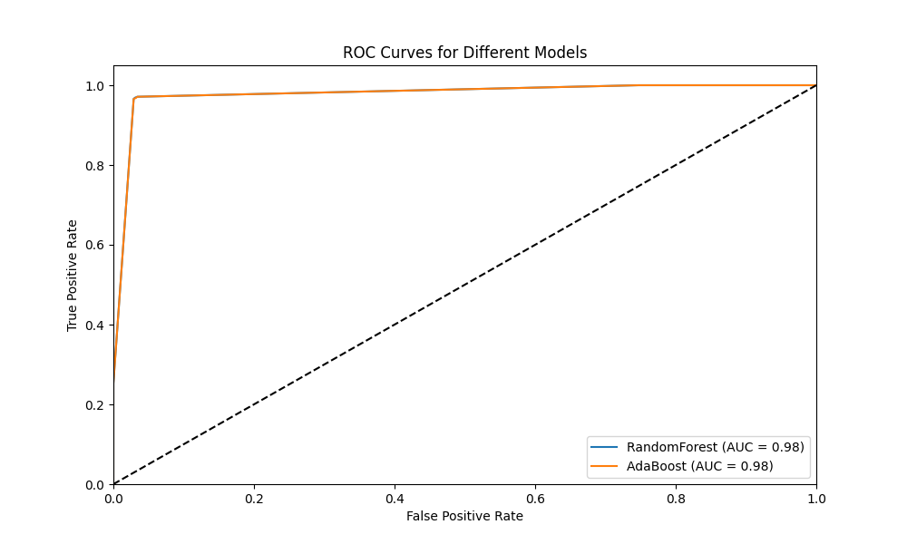

# SamovaR: Advanced Metagenomic Benchmarking and ML Re-profiling Ensemble

> **Attribution and Code Authorship Notice:** > This repository is a fork and extension of the original [SamovaR project by ctlab](https://github.com/ctlab/samovar). The core artificial metagenome generation algorithms belong to the original authors. 
> 
> **My specific contributions to this project include:**
> * **Architectural Refactoring:** Transitioning the pipeline to an Object-Oriented Programming paradigm (developing the `BaseAnnotator` class and specific adapters).
> * **Universal Wrapper:** Developing `custom.sh` to seamlessly integrate any third-party taxonomic classifier.
> * **Tool Integration:** Adding support for Centrifuge (FM-index), Metauto (Custom Deep Learning AutoEncoder), and a Hybrid Assembly-Mapping pipeline (MEGAHIT + Bowtie2 + Kraken2).
> * **Biological Feature Extraction:** Implementing scripts to extract physical read properties (GC-content, sequence length, k-mer distributions).
> * **ML Ensemble:** Developing a Machine Learning pipeline that acts as a voting classifier to correct and re-profile metagenomic annotations.

## Project Structure and Specific Contributions
To implement the ML-ensemble and new annotators, the original monolithic architecture was heavily refactored. The following key files were created or significantly modified as part of my work:

* **Mock Community Generation:**
  * `generate_mock_community.sh`: Created to synthesize a highly complex artificial community comprising exactly 10 bacteria, 10 archaea, 10 eukaryotes, and 10 viruses. This was specifically designed to stress-test annotators and prove the ML ensemble's efficacy on difficult data.
* **Environment and Setup:**
  * `environment.yml` (Strict dependency management)
* **OOP Core and Parsers:**
  * `src/samovar/parse_annotators.py` (Refactored to OOP)
  * `src/samovar/annotators_wrapper.py` (New wrapper class)
  * `src/samovar/taxonomy_engine.py` (New taxonomy standardization logic)
* **Adapters and Custom Wrappers:**
  * `src/annotators/custom.sh` (The universal tool router)
  * `src/annotators/centrifuge.sh`, `src/annotators/metauto.sh`, `src/annotators/assembly_hybrid.sh` (Tool-specific logic)
  * `src/annotators/metauto.py`, `src/annotators/fastq_annotator.py` (Python logic and DL integration)
* **Workflow and Data Formatting:**
  * `workflow/annotators/Snakefile` (Refactored to support the dynamic addition of custom annotators)
  * `workflow/combine_annotation_tables.py` and `workflow/compare_annotations.R` (Significantly modified to ensure correct data format standardization and matrix generation)
* **Machine Learning Engine:**
  * `workflow/ML.py` (Feature extraction and training pipeline)
  * `models/samovar_ensemble.joblib` (Trained voting classifier)

## Conceptual Background
The fundamental problem in metagenomic analysis is the lack of objective truth in real environmental samples. Running different annotation tools yields contradictory taxonomic profiles. 

Our core hypothesis is based on the concept of **ML Ensembles**. Different algorithms excel in different parts of the n-dimensional feature space. For example, Kraken excels at classifying well-known bacteria, Kaiju is better suited for Archaea and Eukaryota, while MetaPhlAn is highly accurate on human gut microbiomes. 

Instead of relying on a single tool, SamovaR aggregates predictions. Even a weak annotator can improve the ensemble's overall quality if it correctly classifies a specific, previously mishandled subset of the data. 

### How it Works
1. Real reads are initially annotated.
2. An artificial metagenome (with a known ground truth) is generated based on these profiles.
3. The artificial reads are re-annotated by the same tools.
4. A Machine Learning model (voting classifier) is trained on the discrepancies between the annotators predictions and the ground truth, incorporating extracted physical features of the reads.
5. The trained model is applied to correct the final profile.

## System Requirements
* **OS:** Linux (Ubuntu 20.04+ recommended)
* **CPU:** 8+ cores (highly recommended for MEGAHIT assembly and Deep Learning tasks)
* **RAM:** 32GB minimum (required for large databases and ML training)
* **Environment:** Python 3.9+, Bash, and Conda.

## Installation Instructions
To ensure full reproducibility, all dependencies are managed via Conda.

```bash
git clone git@github.com:Konstantaza/samovar.git
cd samovar

# Create and activate the environment
conda env create -f environment.yml
conda activate full_samovar_env

## Architecture and Custom Annotators
To allow the pipeline to work with any third-party software, the `BaseAnnotator` class standardizes data formats and provides a unified interface.

To act as a bridge for new tools, the `src/annotators/custom.sh` script was created. As a Proof of Concept, we integrated three fundamentally different algorithms:
1.  **Centrifuge:** An FM-index based annotator looking for exact matches.
2.  **Metauto (DL):** A custom neural network utilizing an AutoEncoder to extract hidden patterns from k-mer frequencies.
3.  **Assembly-Hybrid:** A pipeline that assembles reads into contigs (`MEGAHIT`), classifies the contigs (`Kraken2`), maps the original reads back to the contigs (`Bowtie2`), and projects the taxonomy back to the individual reads.

### Running the Pipeline
```bash
samovar preprocess \
    --output_dir samovar_out \
    --custom-test "metauto /path/to/db" \
    --custom-test "centrifuge /path/to/db" \
    --custom-test "assembly_hybrid /path/to/kraken_db" \
    --threads 16
```

## Results & Biological Validation
To push the limits of the metagenomic annotators, we generated a highly complex artificial mock community (10 Bacteria, 10 Archaea, 10 Eukaryotes, and 10 Viruses).
*(Note: Complete R-generated visual reports can be found in the root directory file `Rplots.pdf`)*.

### Annotator Discrepancies
Single algorithms have different blind spots and generate non-overlapping errors. For instance, reads that Centrifuge classifies confidently might be completely unclassified by Metauto, and vice versa. 

* **Cross-Validation Agreement (Metauto vs Centrifuge):**
  *Located in: `tests_outs/benchmarking/initial_annotations_plots/`*
  
  

### ML Ensemble Performance
The ML ensemble (RandomForest/AdaBoost) successfully aggregates weak predictions and biological features. While individual baseline tools may struggle on highly complex communities, the voting classifier effectively compensates for individual errors.

* **F1-Score Comparison:**
  *Located in: `tests_outs/benchmarking/ml_results_plots/`*
  
  

* **ROC-AUC Performance:**
  *Located in: `tests_outs/benchmarking/ml_results/`*
  
  

**Conclusion:** The classification by voting using the ML-ensemble significantly increases metrics like ROC-AUC and stabilizes the cross-validation process, extracting maximum information from the metagenomic data even when single tools fail.