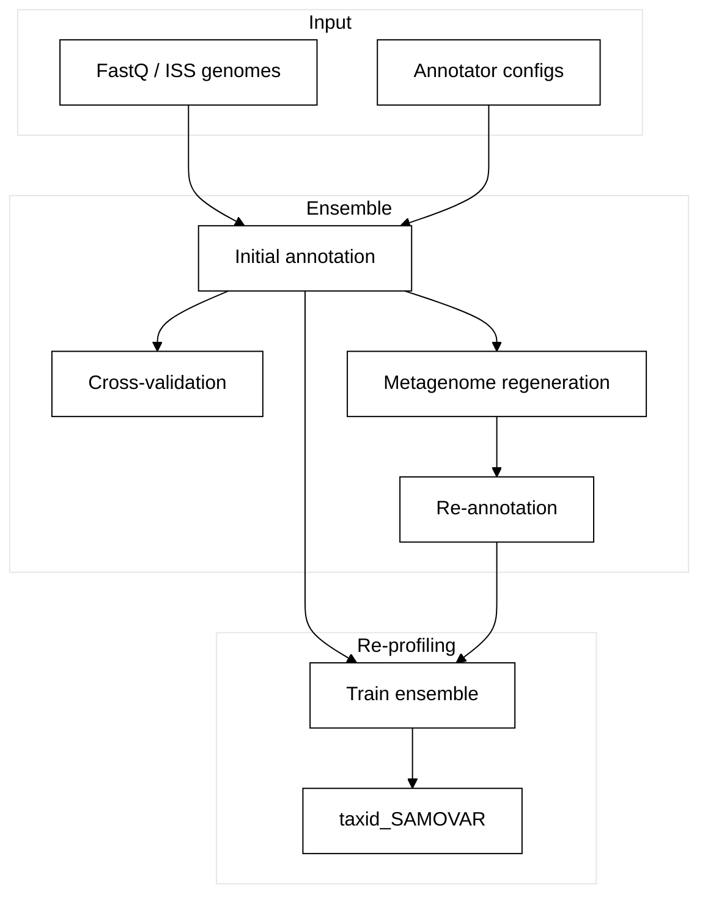

# SAMOVAR <a href=""></a>
### Ensemble taxonomic annotation, cross-validation, and ML re-profiling of metagenomes

[](https://itmo.ru/)
[](https://github.com/ctlab/samovar/actions/workflows/python-package.yml)

In metagenomics, we often do not know which tool to use (or, which is much worse - know because they are SOTA). SAMOVAR team try to solve this problem with the automated benchmark based on the real inputed data to include in the model selection process information about the real community properties

Metagenomic classifiers disagree. SAMOVAR treats **multiple annotators as an ensemble**: it runs them on the same reads, cross-validates calls, regenerates in-silico communities from those calls, and trains a supervised **re-profiler** (SAMOVAR) that combines the tools.

## Ensemble annotation

Built-in ensemble members (wired through `samovar prepare`):

| Tool | Role in the ensemble |
|------|----------------------|
| **Kraken2** | k-mer LCA classifier |
| **Kaiju** | protein-level (translated) classifier |
| **Kraken / KrakenUniq** | additional k-mer votes |
| **MetaPhlAn** | marker-gene profiler |
| **Custom** | extra votes; can be easily additionally implemented for the developers |

Workflow:

1. Annotate real or ISS-simulated reads with every configured tool.
2. Cross-validate taxIDs across tools (CV heatmaps) and against known truth when available (F1 / R²).
3. Re-simulate a community from the annotation table (annotation2iss).
4. Re-annotate the synthetic reads and train an ML ensemble (`workflow/ML.py`: RandomForest / AdaBoost) that maps tool votes → corrected taxID.


```mermaid
%%{init: {'theme': 'base', 'themeVariables': { 'fontSize': '16px', 'fontFamily': 'arial', 'primaryColor': '#fff', 'primaryTextColor': '#000', 'primaryBorderColor': '#000', 'lineColor': '#000', 'secondaryColor': '#fff', 'tertiaryColor': '#fff'}}}%%
graph TD
    subgraph Input
        A1[FastQ / ISS genomes]
        A3[Annotator configs]
    end

    subgraph Ensemble
        A1 --> C[Initial annotation]
        A3 --> C
        C --> CV[Cross-validation]
        C --> E[Metagenome regeneration]
        E --> F[Re-annotation]
    end

    subgraph Re-profiling
        C --> ML[Train ensemble]
        F --> ML
        ML --> R[taxid_SAMOVAR]
    end
```

## Installation

Python 3.10+; **conda is recommended**. R is not required.

```bash
git clone https://github.com/ctlab/samovar
cd samovar
conda env create -f environment.yml
conda activate samovar
chmod +x install.sh
./install.sh
```

Or without conda:

```bash
python3 -m pip install -e .
./install.sh
```

`install.sh` writes `~/.config/samovar/config.json` (and a copy at `build/config.json`) with the repo root, Python path, NCBI email, and any annotators found on `$PATH`. After that, `samovar` can be run from any directory.

It will prompt for an NCBI Entrez email (genome downloads). In CI the default is `test@samovar.com`. Override with `NCBI_EMAIL=you@institution.edu`.

- Production install: `./install.sh` (no pytest extras). Adds `bin/` to this session's `PATH` and to `~/.bashrc` unless another `samovar` is already on `PATH`.
- Shared / HPC (no PATH or bashrc edits): `SAMOVAR_UPDATE_SHELL=0 ./install.sh` then `source ~/.config/samovar/env`
- Dev / CI: `SAMOVAR_INSTALL_DEV=1 ./install.sh`
- Air-gapped: `SAMOVAR_OFFLINE=1 SAMOVAR_WHEELHOUSE=/path/to/wheels ./install.sh`
- Optional R package: `./install.sh R-package` (installs `samovaR` from GitHub branch [`r-package`](https://github.com/ctlab/samovar/tree/r-package) if it is not already present; warns with the installed version if it is)

Annotators such as `kraken2` and `kaiju` may be given as names on `$PATH` (no full path required):

```bash
samovar prepare --output_dir samovar_out --kraken2-test "kraken2 $DB_KRAKEN2"
```

FASTQ inputs may be `.fastq`, `.fq`, or gzip (`.fastq.gz` / `.fq.gz`). Processed genomes are stored gzip-compressed by default (`samovar prepare --gzip-genomes`, on unless you pass `--no-gzip-genomes`). ISS still gets a temporary uncompressed FASTA; the original `.gz` is left in place. Optional `--gzip-reads` compresses simulated FASTQ after ISS.

## Usage

```bash
# Generate metagenome (skip for running SAMOVAR on real data as ensemble)
samovar generate \
    --genome_dir $SAMOVAR/data/test_genomes/meta \
    --host_genome $SAMOVAR/data/test_genomes/host/9606.fna \
    --output_dir samovar_out

# Prepare workflow & scripts, create generation config
samovar prepare \
    --output_dir samovar_out \
    --kraken2-test "kraken2 $DB_KRAKEN2" \
    --kaiju-test "kaiju $DB_KAIJU"

# Do SAMOVARing (resumes from `.log/checkpoints`; `--redo` reruns every step)
samovar exec --output_dir samovar_out
# Optional: drop `.tmp` / ISS scratch after a successful run
# samovar exec --output_dir samovar_out --cleanup-tmp
```

Annotators in **another conda env or module** go in `~/.config/samovar/config.json` (copied to `build/config.json` on install):

```json
{
  "path": ["/opt/other-env/bin"],
  "tools": { "kaiju": "/opt/conda/envs/kaiju/bin/kaiju" },
  "tool_envs": { "kaiju": "/opt/conda/envs/kaiju" }
}
```

`path` and `tool_envs.<name>/bin` plus parent dirs of `tools.*` are prepended in generated `.log/samovar.sh`, so `bash .log/samovar.sh` finds them without `module load`. Extra dirs at runtime: `SAMOVAR_PATH=/more/bin`. 


**Important**: if you want to re-use SAMOVAR, it is needed to re-run samovar generate, preprocess & exec stages after the installation, not to reuse pre-existing ones because they have hard-coded information about the environment paths. Also, re-run these stages after editing config. `./install.sh` keeps existing `path` / `tools` / `tool_envs`.

## R package

The optional R generator (`samovar_boil`) lives on the **[`r-package`](https://github.com/ctlab/samovar/tree/r-package)** branch and is **not** part of this tree. Install it with `./install.sh R-package` (requires R + remotes). That writes a small R driver into `~/.config/samovar/` that only calls exported `samovaR` functions. Then set `regeneration_mode: samovar`.

Python modes (no R): `direct` (default; same samples), `bootstrap` (noisy copies of real samples), `vae`, `glm` (cluster + Gaussian GLM walk, same logic as the R package). Rescaling column totals to `N_reads` is opt-in via `rescale_abundance: true`.

## References

- Chechenina А., Vaulin N., Ivanov A., Ulyantsev V. Development of in-silico models of metagenomic communities with given properties and a pipeline for their generation. Bioinformatics Institute 2022/23 URL: https://elibrary.ru/item.asp?id=60029330

- Do not forget to cite all annotators used for the ensemble
