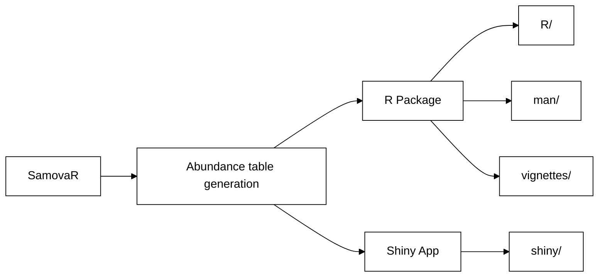
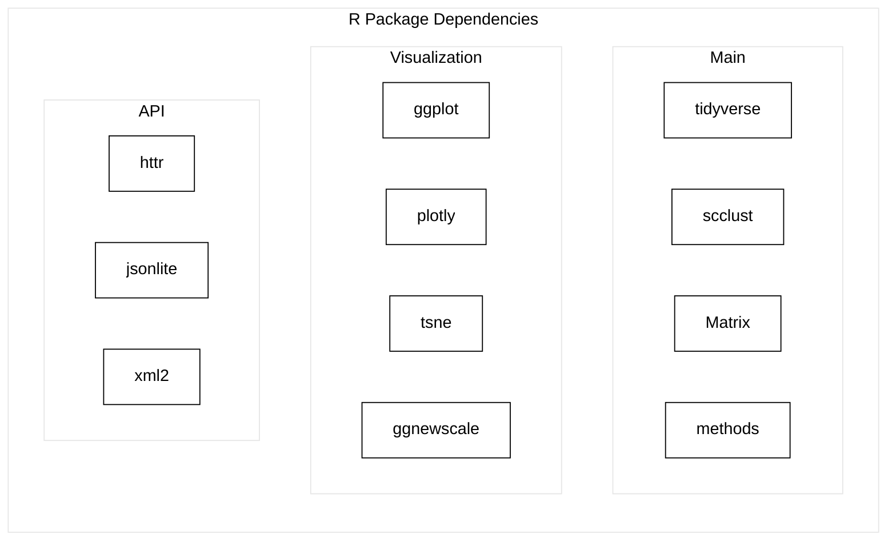

# SamovaR <a href=""></a>
### Automated re-profiling & benchmarking of metagenomic tools based on artificial data generation


[](https://github.com/ctlab/samovar/actions/workflows/R-CMD-check.yaml)
[](https://itmo.ru/)

There is a fundamental problem in modern ***metagenomics***: there are huge differences between methodological approaches that strongly influence the results, while remaining outside the attention of researchers.

The use of golden practice and open code, while allowing data to be analyzed reproducibly, locks scientists into a single, far from perfect approach, with its own bias.

Therefore, we propose an approach that utilizes de novo generation of the artificial metagenomes - `SamovaR`.

This branch is the independent **R generator of abundance tables**. The Python ensemble / ISS pipeline lives on the main branch and can optionally call this generator.

## Installation

### Quick Installation

Use installation script from the source of this package:

```r
devtools::install_github("https://github.com/ctlab/samovar/", ref = "r-package")
```

***Attention:*** *check that samovar can be loaded with* ```Rscript -e 'library(samovaR)'```, *especially in case of several R versions installed*

### Manual Installation

```bash
git clone https://github.com/ctlab/samovar
cd samovar
git checkout r-package
R CMD INSTALL .
```

***Attention**: the installer automatically detects custom R library paths from `.Renviron` (R_LIBS) or `.Rprofile` (libPaths())*

## Components

- **R** package `samovaR` for the artificial abundance table generation
- Optional **Shiny** app for interactive generation

## Project Structure


```mermaid
%%{init: {'theme': 'base', 'themeVariables': { 'fontSize': '16px', 'fontFamily': 'arial', 'primaryColor': '#fff', 'primaryTextColor': '#000', 'primaryBorderColor': '#000', 'lineColor': '#000', 'secondaryColor': '#fff', 'tertiaryColor': '#fff'}}}%%
graph LR
    A[SamovaR] --> G1[Abundance table generation]
    G1 --> B[R Package]
    G1 --> G[Shiny App]

    B --> B1[R/]
    B --> B2[man/]
    B --> B3[vignettes/]

    G --> H[shiny/]
```

## Usage

### Artificial metagenome generation
Basic usage described in <a href="./vignettes">**vignettes**</a> and <a href="https://github.com/ctlab/samovar/wiki">**wiki**</a>

You can also try the generator with <a href="https://dsmutin.shinyapps.io/samovaR/">**web** shiny app</a>


#### R generation

<a href="https://github.com/ctlab/samovar/blob/main/samovaR.pdf">See description</a> or <a href="vignettes/samovar-basic.Rmd">source</a> a vignette

``` r
library(samovaR)

# download data
teatree <- GMrepo_type2data(number_to_process = 2000)

# filter
tealeaves <- teatree %>%
  teatree_trim(treshhold_species = 3, treshhold_samples = 3, treshhold_amount = 10^(-3))

# normalizing
teabag <- tealeaves %>%
  tealeaves_pack()

# clustering
concotion <- teabag %>%
  teabag_brew(min_cluster_size = 4, max_cluster_size = 6)

# building samovar
samovar <- concotion %>%
  concotion_pour()

# generating new data
new_data <- samovar %>%
  samovar_boil(N = 100)
```

<a src="https://github.com/ctlab/samovar/blob/main/samovaR_man.pdf">Documentation</a> for the **R package**

#### Pipeline


## References
- Chechenina А., Vaulin N., Ivanov A., Ulyantsev V. Development of in-silico models of metagenomic communities with given properties and a pipeline for their generation. Bioinformatics Institute 2022/23 URL: https://elibrary.ru/item.asp?id=60029330


## Dependencies


```mermaid
%%{init: {'theme': 'base', 'themeVariables': { 'fontSize': '16px', 'fontFamily': 'arial', 'primaryColor': '#fff', 'primaryTextColor': '#000', 'primaryBorderColor': '#000', 'lineColor': '#000', 'secondaryColor': '#fff', 'tertiaryColor': '#fff'}}}%%
graph LR
    subgraph "R Package Dependencies"
        subgraph "Main"
            direction LR
            tidyverse
            scclust
            Matrix
            methods
        end
        
        subgraph "Visualization"
            direction LR
            ggplot
            plotly
            tsne
            ggnewscale
        end
        
        subgraph "API"
            direction LR
            httr
            jsonlite
            xml2
        end
    end
    
    linkStyle default stroke:#000
```
