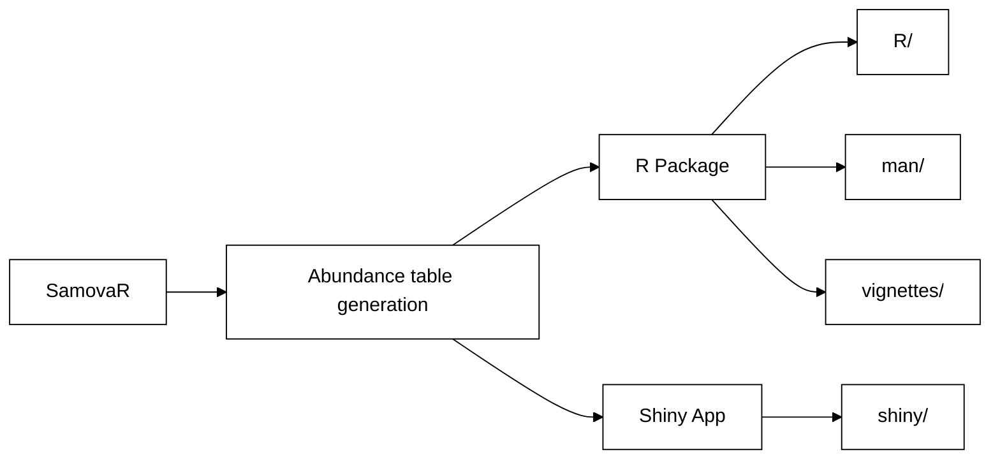
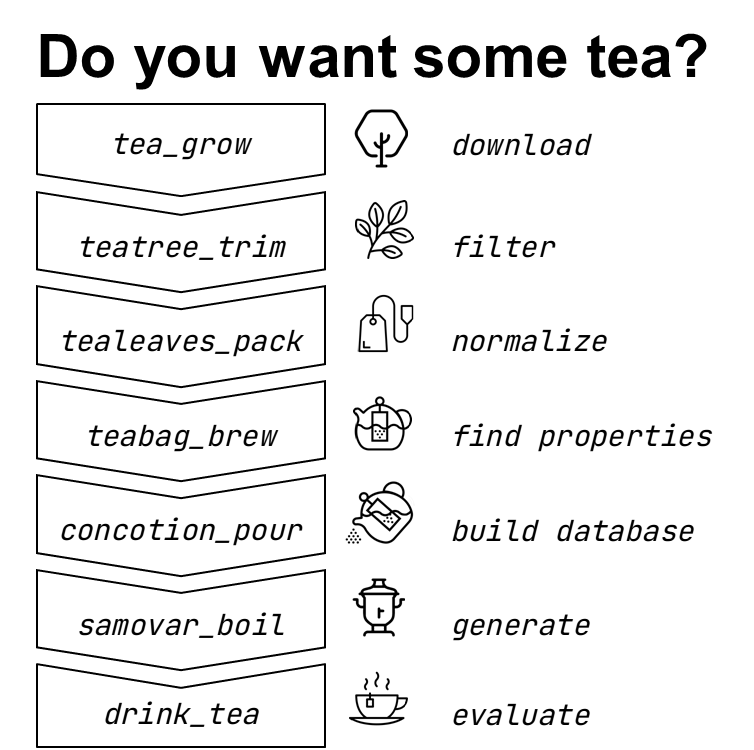
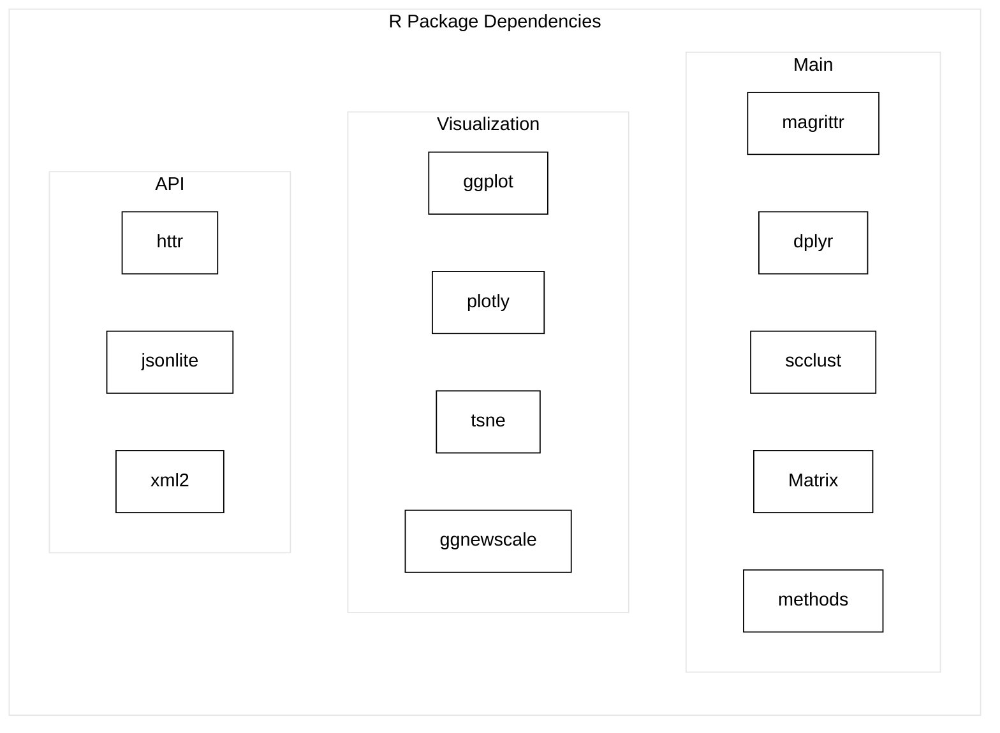

# SamovaR <a href=""></a>
### Automated re-profiling & benchmarking of metagenomic tools based on artificial data generation


[](https://github.com/ctlab/samovar/actions?query=branch%3Ar-package+event%3Apush+workflow%3A%22R+package%22)
[](https://itmo.ru/)

There is a fundamental problem in modern ***metagenomics***: there are huge differences between methodological approaches that strongly influence the results, while remaining outside the attention of researchers.

The use of golden practice and open code, while allowing data to be analyzed reproducibly, locks scientists into a single, far from perfect approach, with its own bias.

Therefore, we propose an approach that utilizes de novo generation of the artificial metagenomes - `SamovaR`.

This branch is the independent **R generator of abundance tables**. The Python ensemble / ISS pipeline lives on the main branch and can optionally call this generator.

## Installation

Needs **R ≥ 3.5**. The package name is `samovaR` (capital R).

### From GitHub

```r
install.packages("remotes")   # once, if remotes is not installed
remotes::install_github("ctlab/samovar", ref = "r-package")
```

`devtools::install_github()` works the same way. Always pass `ref = "r-package"` — the default branch is the Python tool, not this generator.

### From a local clone

```bash
git clone https://github.com/ctlab/samovar
cd samovar
git checkout r-package
R CMD INSTALL .
```

Or in R, from the clone: `remotes::install_local(".")`.

R installs into the first library in `.libPaths()`. If you keep a custom library, set `R_LIBS` in `~/.Renviron` (or `libPaths()` in `~/.Rprofile`) **before** installing.

### Check that it loaded

```r
library(samovaR)
packageVersion("samovaR")   # expect 1.0.0
```

If several R versions are installed, run the same check with that version’s `Rscript`:

```bash
Rscript -e 'library(samovaR); packageVersion("samovaR")'
```

## Components

- **R** package `samovaR` for the artificial abundance table generation
- Optional **Shiny** app for interactive generation (`shiny/demo.R`, or the [web app](https://dsmutin.shinyapps.io/samovaR/))

## Project Structure


```mermaid
%%{init: {'theme': 'base', 'themeVariables': { 'fontSize': '16px', 'fontFamily': 'arial', 'primaryColor': '#fff', 'primaryTextColor': '#000', 'primaryBorderColor': '#000', 'lineColor': '#000', 'secondaryColor': '#fff', 'tertiaryColor': '#fff'}}}%%
graph LR
    A[SamovaR] --> G1[Abundance table generation]
    G1 --> B[R Package]
    G1 --> G[Shiny App]

    B --> B1[R/]
    B --> B2[man/]
    B --> B3[vignettes/]

    G --> H[shiny/]
```

## Usage

Full walkthrough: [vignette](vignettes/samovar-basic.Rmd), [PDF overview](samovaR.pdf), [function reference](samovaR_man.pdf), [wiki](https://github.com/ctlab/samovar/wiki). Interactive: [shiny app](https://dsmutin.shinyapps.io/samovaR/).

```r
library(samovaR)

# 1. Load an abundance table (species × samples).
#    GMrepo first; if the API is down, packaged example data is used.
teatree <- GMrepo_type2data_or_example(number_to_process = 1500)

#    Or skip GMrepo and use your own matrix / CSV:
# teatree <- table2samovar(my_matrix)
# teatree <- read_samovar("abundances.csv")

viz_composition(teatree, type = "tile", interactive = FALSE, top = 10)

# 2. Drop rare species/samples and near-zero noise
tealeaves <- teatree %>%
  teatree_trim(treshhold_species = 3, treshhold_samples = 3, treshhold_amount = 1e-3)

# 3. Transform abundances (default log10(x + 1)) so GLM later is stable
teabag <- tealeaves %>%
  tealeaves_pack()

# 4. Cluster species that co-vary (min/max cluster size)
concotion <- teabag %>%
  teabag_brew(min_cluster_size = 4, max_cluster_size = 6)

# 5. Fit within- and between-cluster models
samovar <- concotion %>%
  concotion_pour(probability_calculation = "simple")

# 6. Draw N new samples. Result is a samovar_run; abundances in $data
new_data <- samovar %>%
  samovar_boil(N = 100, avoid_zero_generations = TRUE)

viz_composition(new_data, type = "tile", interactive = FALSE, top = 10)
head(new_data$data)
```

One-call equivalent of steps 2–5: `samovar_preprocess(teatree)`.



## References
- Chechenina А., Vaulin N., Ivanov A., Ulyantsev V. Development of in-silico models of metagenomic communities with given properties and a pipeline for their generation. Bioinformatics Institute 2022/23 URL: https://elibrary.ru/item.asp?id=60029330


## Dependencies


```mermaid
%%{init: {'theme': 'base', 'themeVariables': { 'fontSize': '16px', 'fontFamily': 'arial', 'primaryColor': '#fff', 'primaryTextColor': '#000', 'primaryBorderColor': '#000', 'lineColor': '#000', 'secondaryColor': '#fff', 'tertiaryColor': '#fff'}}}%%
graph LR
    subgraph "R Package Dependencies"
        subgraph "Main"
            direction LR
            magrittr
            dplyr
            scclust
            Matrix
            methods
        end
        
        subgraph "Visualization"
            direction LR
            ggplot
            plotly
            tsne
            ggnewscale
        end
        
        subgraph "API"
            direction LR
            httr
            jsonlite
            xml2
        end
    end
    
    linkStyle default stroke:#000
```
