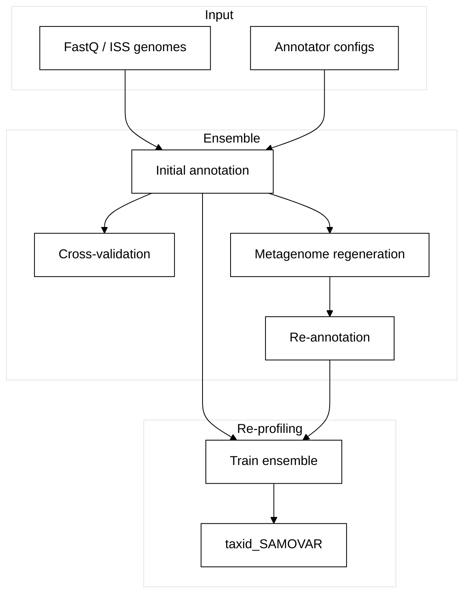

# SAMOVAR <a href=""></a>
### Metagenomic ensemble taxonomic annotation, cross-validation, and ML re-profiling

[](https://itmo.ru/)
[](https://github.com/ctlab/samovar/actions/workflows/python-package.yml)

In metagenomics, we often do not know which tool to use (or, which is much worse - know because they are SOTA). SAMOVAR team try to solve this problem with the automated benchmark based on the real inputed data to include in the model selection process information about the real community properties

Metagenomic classifiers disagree. SAMOVAR treats **multiple annotators as an ensemble**: it runs them on the same reads, cross-validates calls, regenerates in-silico communities from those calls, and trains a supervised **re-profiler** (SAMOVAR) that combines the tools.

What does the tool do? It gets the metagenome input & taxonomy profiling tools and SAMOVAR that (regenerate artficial metagenomes, evaluate & combine the tools).

We strongly recommend to understand SAMOVAR main concepts before the installation & usage, because the workflow is large & depends on a lot of other different tools

## Installation

Python 3.10+; **conda is recommended**.

```bash
git clone https://github.com/ctlab/samovar
cd samovar
conda env create -f environment.yml
conda activate samovar
chmod +x install.sh
./install.sh
```

`install.sh` may ask you some questions, like e-mail for the NCBI API.

Some tools are optional but may be usefull (samovar R package, CAMISIM, MultiQC and other). More details on the installation [github wiki page](wiki/How-to-install). 

The install JSON layout is described in [wiki](wiki/Configs-&-data).

## Ensemble annotation

Built-in ensemble members (wired through `samovar prepare`):

| Tool | Role in the ensemble |
|------|----------------------|
| **Kraken2** | k-mer LCA classifier |
| **Kaiju** | protein-level (translated) classifier |
| **Kraken / KrakenUniq** | additional k-mer votes |
| **MetaPhlAn** | marker-gene profiler |
| **Custom** | extra votes; can be easily additionally implemented for the developers |

Workflow:

1. Annotate real or ISS-simulated reads with every configured tool.
2. Cross-validate taxIDs across tools (CV heatmaps) and against known truth when available (F1 / R²).
3. Re-simulate a community from the annotation table (annotation2iss).
4. Re-annotate the synthetic reads and train an ML ensemble (`workflow/ML.py`: RandomForest / AdaBoost) that maps tool votes → corrected taxID.


```mermaid
%%{init: {'theme': 'base', 'themeVariables': { 'fontSize': '16px', 'fontFamily': 'arial', 'primaryColor': '#fff', 'primaryTextColor': '#000', 'primaryBorderColor': '#000', 'lineColor': '#000', 'secondaryColor': '#fff', 'tertiaryColor': '#fff'}}}%%
graph TD
    subgraph Input
        A1[FastQ / ISS genomes]
        A3[Annotator configs]
    end

    subgraph Ensemble
        A1 --> C[Initial annotation]
        A3 --> C
        C --> CV[Cross-validation]
        C --> E[Metagenome regeneration]
        E --> F[Re-annotation]
    end

    subgraph Re-profiling
        C --> ML[Train ensemble]
        F --> ML
        ML --> R[taxid_SAMOVAR]
    end
```

## Brief Usage

```bash
# Generate metagenome (skip for running SAMOVAR on real data as ensemble)
samovar generate \
    --genome_dir $SAMOVAR/data/test_genomes/meta \
    --host_genome $SAMOVAR/data/test_genomes/host/9606.fna \
    --output_dir samovar_out

# Prepare workflow & scripts, create generation config
samovar prepare \
    --output_dir samovar_out \
    --kraken2-test "kraken2 $DB_KRAKEN2" \
    --kaiju-test "kaiju $DB_KAIJU"

# Do SAMOVARing (resumes from `.log/checkpoints`; `--redo` reruns every step)
samovar exec --output_dir samovar_out

# MultiQC report: optional
# samovar multiqc --output_dir samovar_out -- --export --interactive
```

## R package

The optional R generator (`samovar_boil`) lives on the **[`r-package`](https://github.com/ctlab/samovar/tree/r-package)** branch and is **not** part of this tree. Install it with `./install.sh R-package` (requires R + remotes). That writes a small R driver into `~/.config/samovar/` that only calls exported `samovaR` functions. Then set `regeneration_mode: samovar`.

## References

See the current citation list in the references github wiki. Also, do not forget to cite all annotators used for the ensemble & inside the SAMOVAR