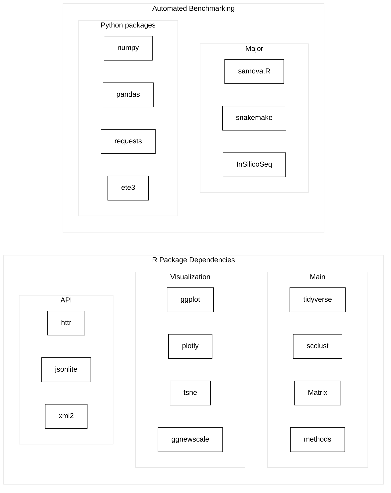

# samova.R 0.7 <a href=""></a> 
### Artificial metagenome generation and automatic benchmarking


[](https://github.com/ctlab/samovar/actions/workflows/R-CMD-check.yaml)
[](https://github.com/ctlab/samovar/actions/workflows/python-package.yaml)

There is a fundamental problem in modern ***metagenomics***: there are huge differences between methodological approaches that strongly influence the results, while remaining outside the attention of researchers. 

The use of golden practice and open code, while allowing data to be analyzed reproducibly, locks scientists into a single, far from perfect approach, with its own bias.

Therefore, we propose an approach that utilizes de novo generation of the artificial metagenomes - `SamovaR`.

## Installation

### Quick Installation

<span style="color:red">Warning:</span> beta
Use installation script:

```bash
git clone https://github.com/ctlab/samovar
cd samovar
chmod +x install.sh
./install.sh
```

*Attention: the script automatically detects custom R library paths from `.Renviron` (R_LIBS) or `.Rprofile` (libPaths())*

### Manual Installation

Install R package:

```r
# If you have a custom library path, specify it:
.libPaths('/path/to/your/R/library')
devtools::install_github("https://github.com/ctlab/samovar/")
```

Install python package:

```bash
git clone https://github.com/ctlab/samovar
cd samovar
pip install -e .
```

## Examples

To check installation or dive into what SamovaR do, run

```bash
cd samovar
bash workflow/pipeline.sh
```

## Components

- **R** package `samova.R` for the artificial abundance table generation
- **Python** + **bash** pipeline for the automated benchmarking

## Project Structure


## Usage
### Full pipeline

To run worklow, specify your config files and run:
```bash
cd samovar
bash workflow/pipeline.sh
```

### R package
Basic usage described in <a href="./vignettes">**vignettes**</a> and <a href="https://github.com/ctlab/samovar/wiki">**wiki**</a>

You can also try the generator with <a href="https://dsmutin.shinyapps.io/samovaR/">**web** shiny app</a>


## R algorithm summary


## R generation

<a href="https://github.com/ctlab/samovar/samovaR.pdf">See description</a> or <a href="vignettes/samovar-basic.Rmd">source</a> a vignette

``` r
library(samovaR)

# download data
teatree <- GMrepo_type2data(number_to_process = 2000)

# filter
tealeaves <- teatree %>%
  teatree_trim(treshhold_species = 3, treshhold_samples = 3, treshhold_amount = 10^(-3))

# normalizing
teabag <- tealeaves %>%
  tealeaves_pack()

# clustering
concotion <- teabag %>%
  teabag_brew(min_cluster_size = 4, max_cluster_size = 6)

# building samovar
samovar <- concotion %>%
  concotion_pour()

# generating new data
new_data <- samovar %>%
  samovar_boil(n = 100)
```

## Documentation
<a src="https://github.com/ctlab/samovar/blob/main/samovaR_man.pdf">Documentation</a> for the **R package**

## Algorithm details


## References
- Chechenina А., Vaulin N., Ivanov A., Ulyantsev V. Development of in-silico models of metagenomic communities with given properties and a pipeline for their generation. Bioinformatics Institute 2022/23 URL: https://elibrary.ru/item.asp?id=60029330


## Dependencies


