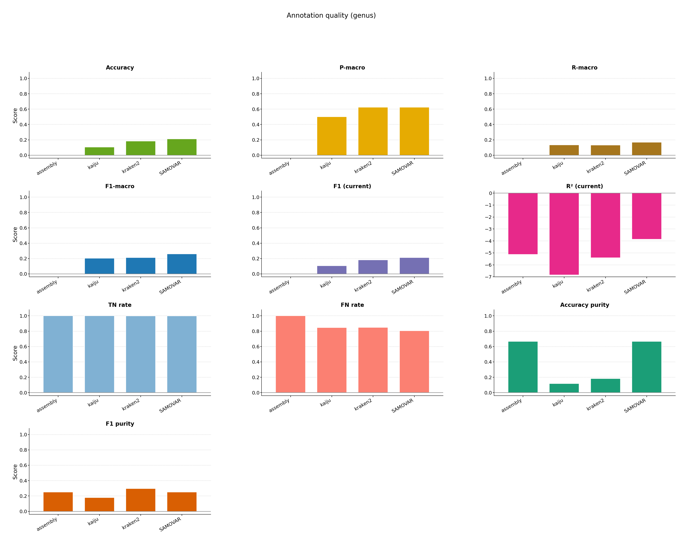
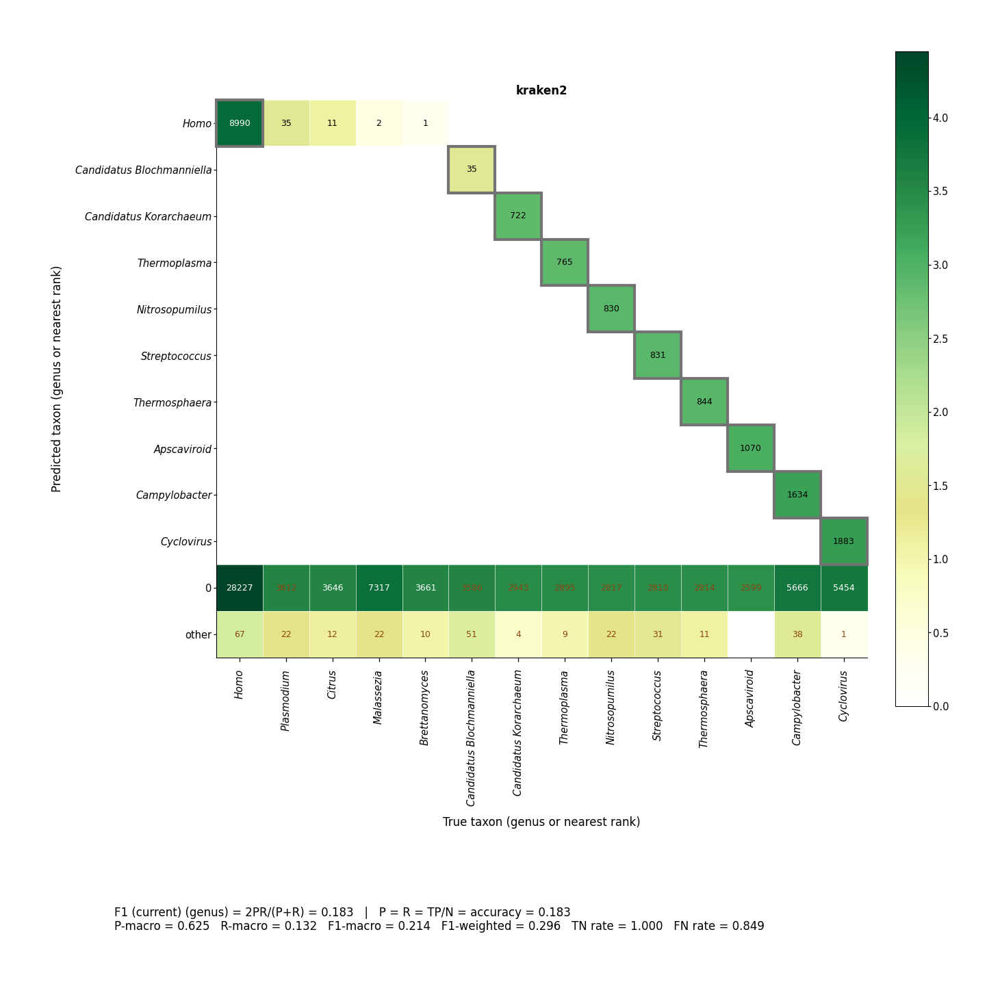

# Assembly MAG_ID Feature

Same community layout as [realistic](../realistic/): NCBI genomes with public Kraken2 (`standard_8GB`) and Kaiju RefSeq, plus an assembly annotator. Each read gets a taxID **and** a Feature `MAG_ID`. Combine labels tax as `taxID_assembly_*` and MAG identity as `feat_assembly_*_MAG_ID`. Scoring uses only tax columns; the ensemble ML reprofiler uses MAG IDs (factorized).

Nested MegaHIT / GTDB-Tk tools are optional. This example uses identity/constant builtins for those slots so it runs on the public indexes without those sidecars.

```bash
bash examples/assembly/pipeline.sh
```





[multiqc/multiqc_report.html](multiqc/multiqc_report.html)
