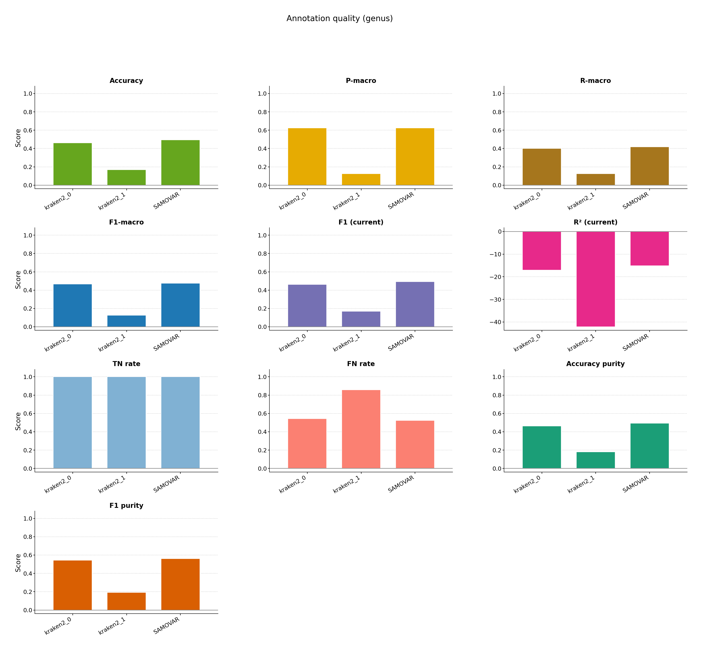
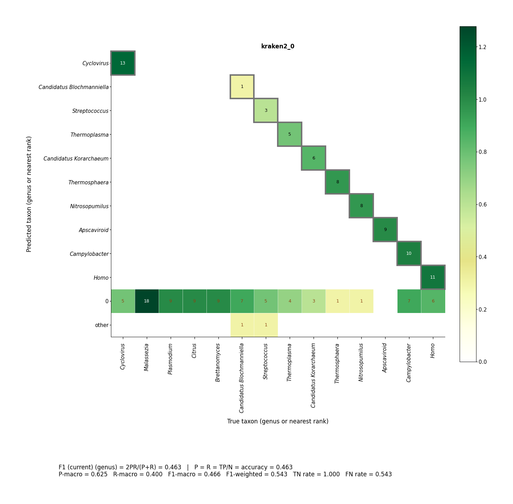

# Databases comparison

One realistic community annotated with more than one Kraken2 index (8 GB standard vs virus).

```bash
bash examples/databases_comparison/pipeline.sh
```





[multiqc/multiqc_report.html](multiqc/multiqc_report.html)
