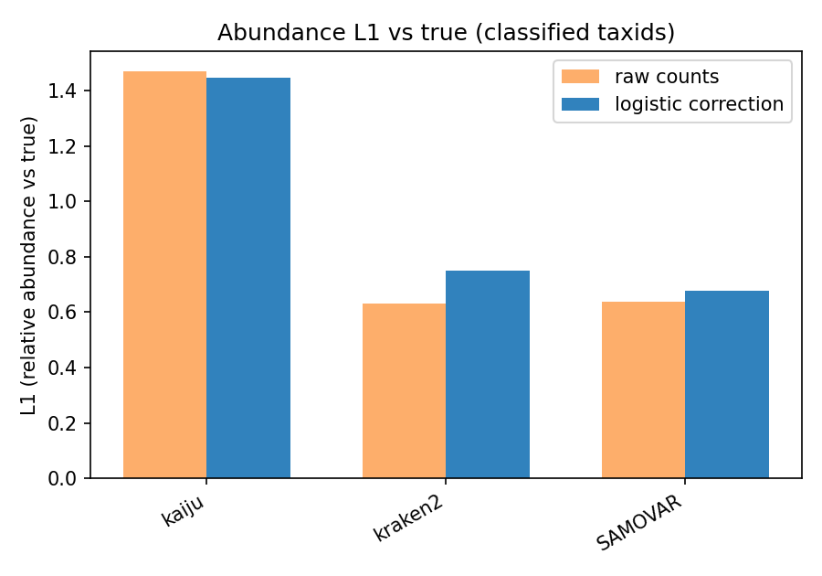
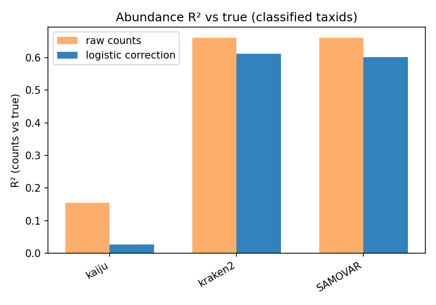

# Logistic abundance correction

Default `samovar prepare` export: Annotation → abundance-like tables with a
per-taxon logistic recall correction (single annotators and the ensemble).

Train on regenerated annotations (`taxID_*` + `true` / `taxID_true`), apply when
leaving Annotation: if taxon `t` is recovered at 98%, predicted counts for `t`
are divided by 0.98.

```bash
bash examples/logistic-correction/pipeline.sh
```

Compared on the completed [realistic](../realistic/) run (NCBI genomes, public
Kraken2 `standard_8GB` + Kaiju RefSeq, 4 × 8000 reads). Same annotations, two
exports — not a second ISS pass. L1 is classified taxids only (relative
abundance vs `true`). R² is SAMOVAR’s count formula
`1 − Σ(n̂_t − n_t)² / Σ(n_t − n̄)²` (classified taxids, mean over samples).
Positive `delta_L1` / `delta_R2` means logistic is closer to truth.

| annotator | L1 raw | L1 logistic |   Δ L1 | R² raw | R² logistic |  Δ R² |
| --------- | -----: | ----------: | ------: | ------: | -----------: | ------: |
| kaiju     |  1.469 |       1.448 |  +0.021 |   0.154 |        0.027 | −0.127 |
| kraken2   |  0.630 |       0.750 | −0.120 |   0.660 |        0.612 | −0.048 |
| SAMOVAR   |  0.636 |       0.677 | −0.041 |   0.660 |        0.602 | −0.058 |

Kaiju’s relative profile is slightly closer after correction (L1), but count-scale
R² falls: logistic inflates taxa on the original samples. Kraken2 and the
ensemble were already the better profiles; recall fitted on the regenerated mix
over-inflates some taxa (worse L1 and R²).

`SAMOVAR_TOY=1` uses the toy Kraken2/Kaiju indexes. If `examples/realistic/run`
already has annotations, the script only recomputes this comparison.

```bash
samovar prepare --output_dir RUN --export logistic   # default
samovar prepare --output_dir RUN --export none       # raw counts
samovar prepare --output_dir RUN --no-export         # skip the stage

samovar tools import -n logistic_correction \
  --exec-path examples/logistic-correction/logistic_corrector.py \
  --type export --pytest
```





Generally, while the taxonomy efficiency corrections helps to re-estimate abundances of the dominant taxa, it introduces errors in the rare taxa abundances
