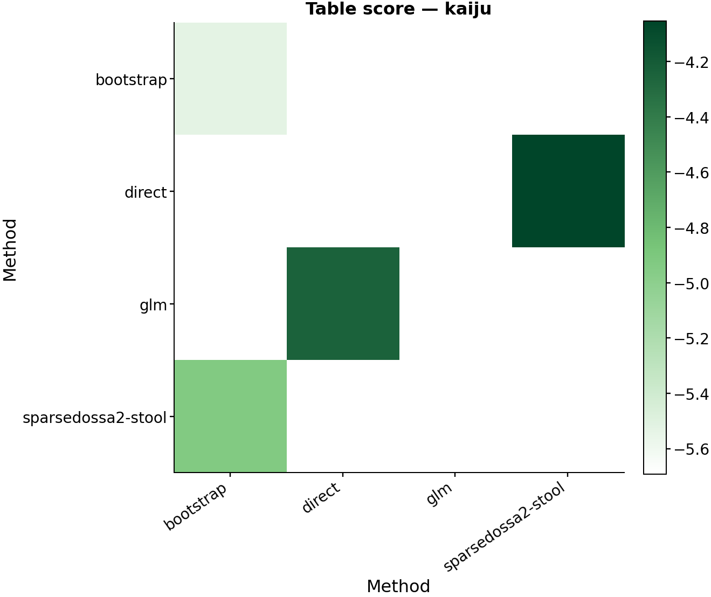
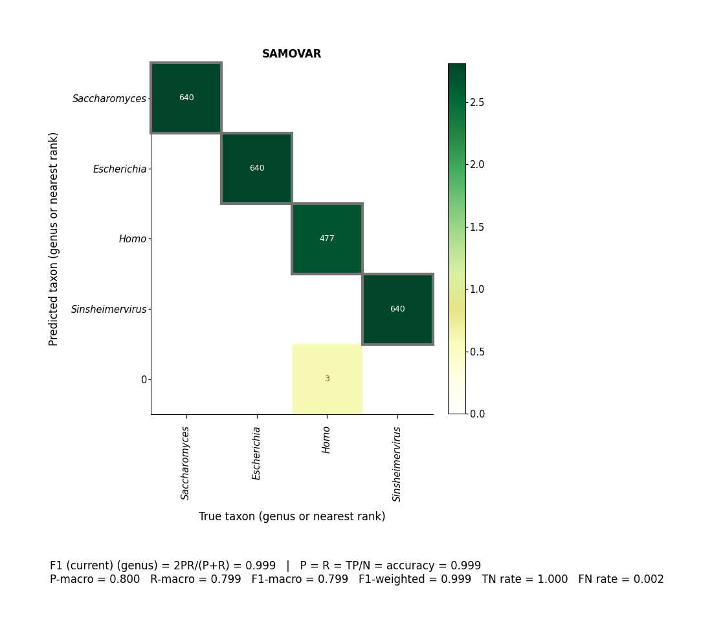

# Multiple tables

Several abundance-table generators are scored (SparseDOSSA2 CV); the winner is used for re-annotation.

```bash
bash examples/multiple_tables/pipeline.sh
```





[multiqc/multiqc_report.html](multiqc/multiqc_report.html)
