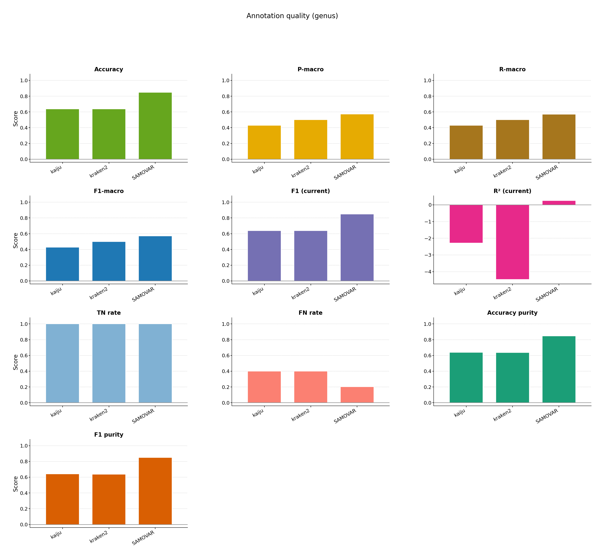

# Phage

Build named `phage_test` indexes, then `generate --reindex` and `samovar reindex`. Kaiju and Kraken2 are built from overlapping but different accession lists so the tools disagree on purpose.

```bash
bash examples/phage/pipeline.sh
```




[multiqc/multiqc_report.html](multiqc/multiqc_report.html)
