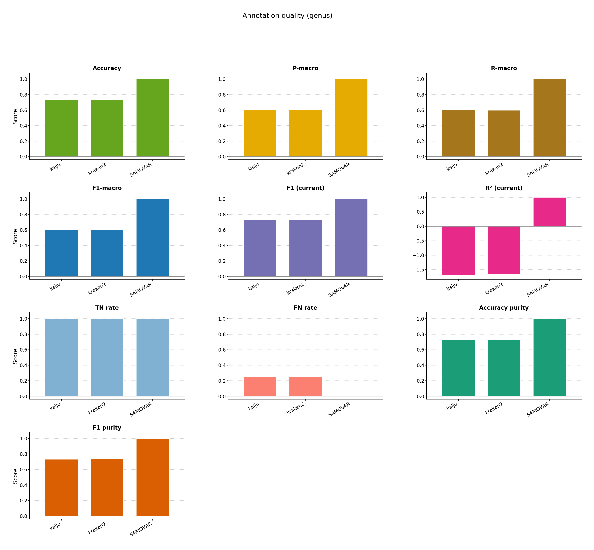
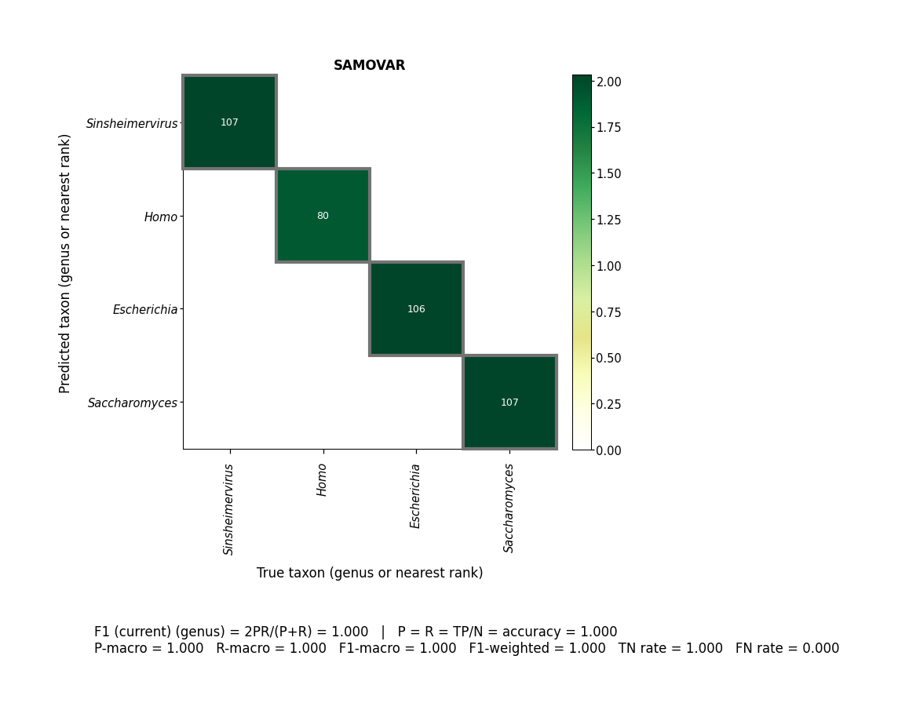

# Reprofiling

Import a custom ML reprofiler (`linear`) and train it on regenerated labels.

```bash
bash examples/reprofiling/pipeline.sh
```





[multiqc/multiqc_report.html](multiqc/multiqc_report.html)
