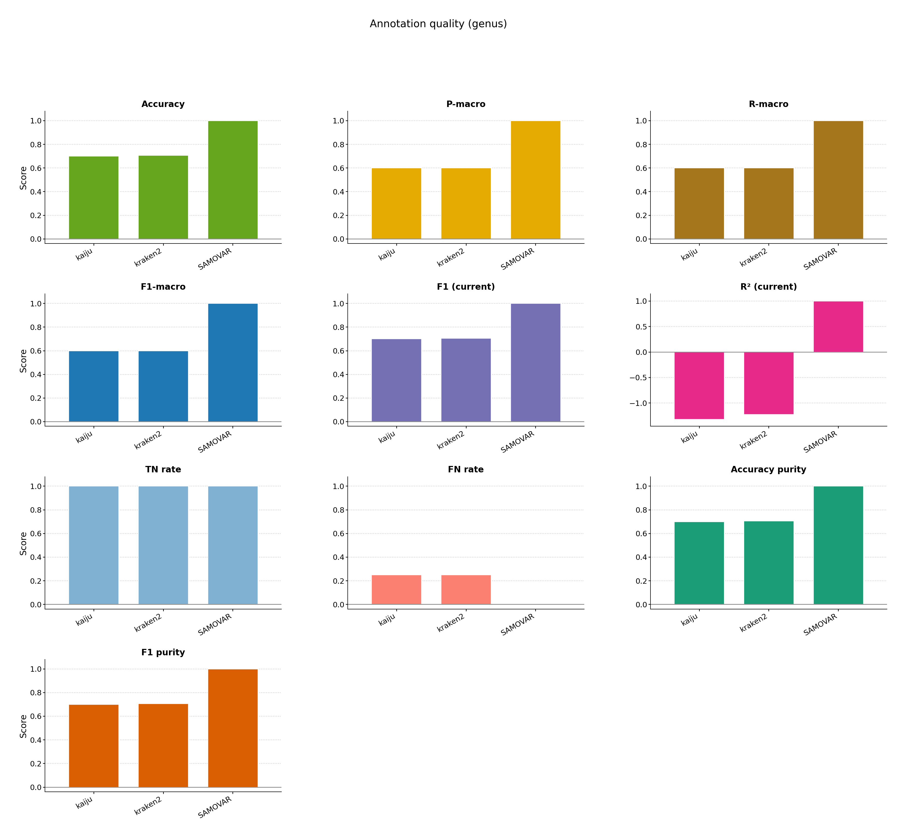
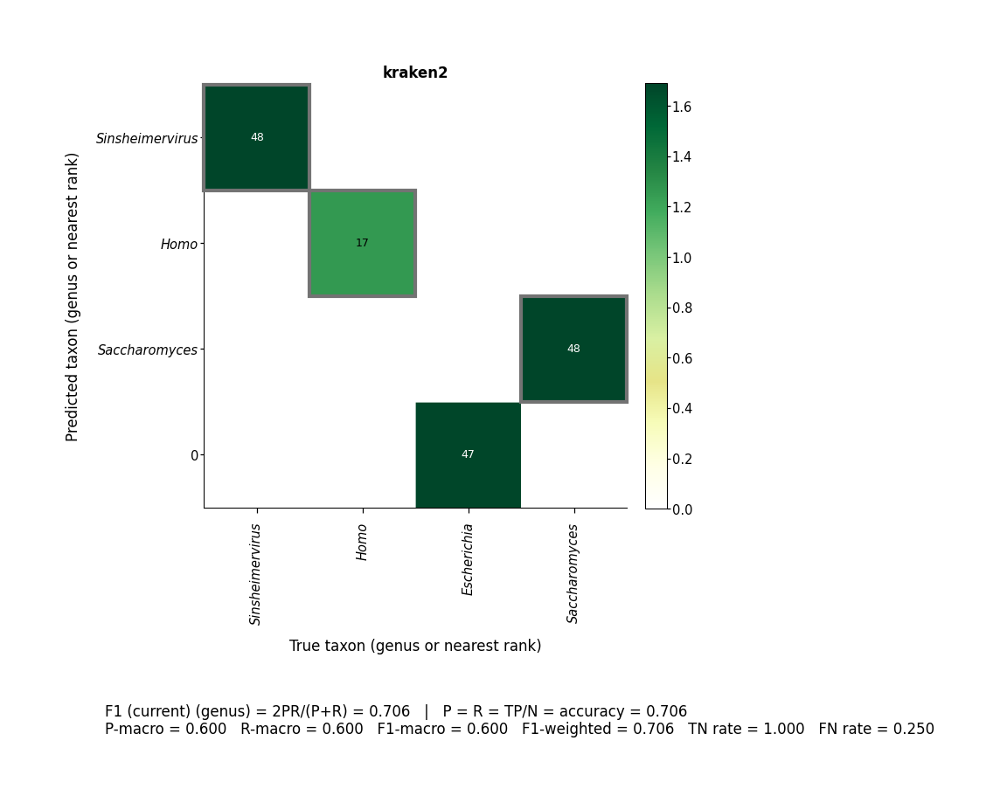

# Scoring

Compare annotators on the same reads (Kraken2 vs Kaiju) and import a small custom scorer.

```bash
bash examples/scoring/pipeline.sh
```





[multiqc/multiqc_report.html](multiqc/multiqc_report.html)
