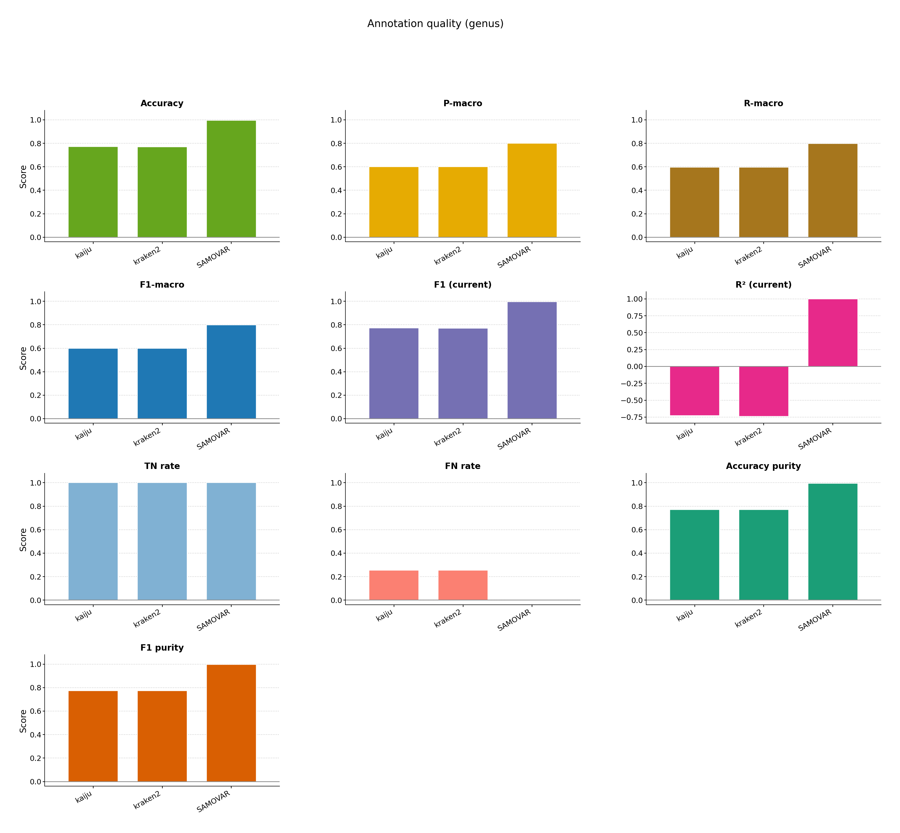
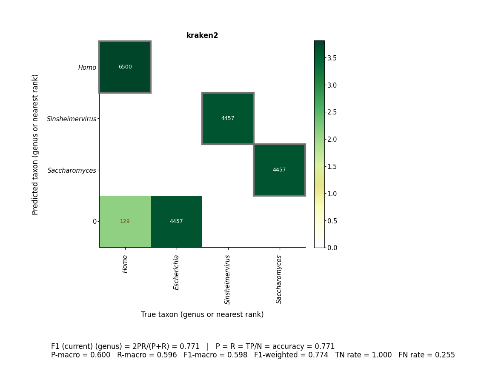

# Toy

Basic SamovaR run: simulate a small community, annotate it with toy Kraken2 and Kaiju, regenerate, and train the ensemble.

```bash
bash examples/toy/pipeline.sh
```

SamovaR’s loop is: **generate** reads → **annotate** with each tool → **regenerate** a community from those calls → **reprofile** the original samples. The MultiQC report for this example walks through those stages. Broader documentation is on the [wiki](https://github.com/ctlab/samovar/wiki) ([Home](https://github.com/ctlab/samovar/wiki/Home)).





[multiqc/multiqc_report.html](multiqc/multiqc_report.html)
