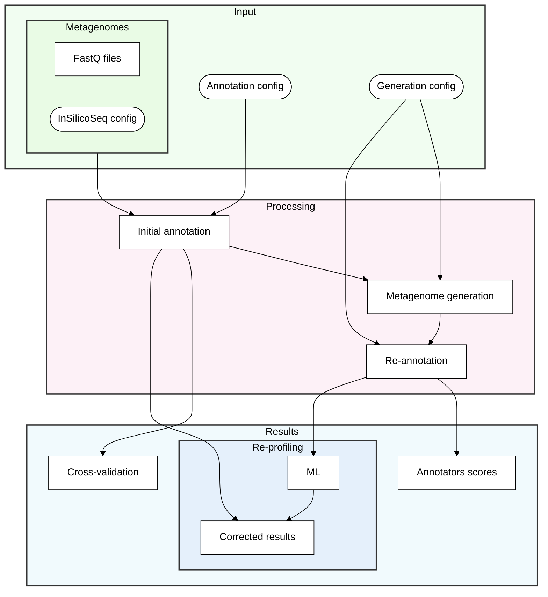

# Samovar Pipeline Documentation

## Overview

The Samovar pipeline is a comprehensive workflow for metagenomic analysis that combines artificial metagenome generation, database preparation, annotation, and visualization. The pipeline is orchestrated through a series of Snakemake workflows and supporting scripts.

## Pipeline Flow



## Pipeline Steps

1. **InSilicoSeq Generation** (`workflow/iss_test/Snakefile`)
   - Generates synthetic metagenomic reads
   - Configurable through `workflow/iss_test/config.yaml`

2. **Database Preparation** (`workflow/database_prep/Snakefile`)
   - Subsets genomes for database creation
   - Builds Kraken2 and Kaiju databases
   - Configurable through `workflow/database_prep/config.yaml`

3. **Initial Annotation** (`workflow/annotators/Snakefile`)
   - Runs annotators on initial reads
   - Uses `workflow/annotators/config_init.yaml`
   - Combines annotation tables using `combine_annotation_tables.py`
   - Generates initial visualizations using `compare_annotations.R`

4. **Annotation Translation** (`workflow/annotation2iss/Snakefile`)
   - Translates annotation table to new reads set
   - Configurable through `workflow/annotation2iss/config.yaml`

5. **Re-annotation** (`workflow/annotators/Snakefile`)
   - Runs annotators on new reads set
   - Uses `workflow/annotators/config_reannotate.yaml`
   - Combines and visualizes results

## Usage

To run the complete pipeline:

```bash
cd samovar
bash workflow/pipeline.sh
```

## Output Structure

The pipeline generates the following outputs in the `tests_outs/benchmarking/` directory:

- `initial_reports/`: Initial annotation results
- `initial_annotations/`: Combined initial annotations
- `initial_annotations_plots/`: Visualizations of initial results
- `regenerated/`: Generated reads
- `regenerated_reports/`: Re-annotation results
- `regenerated_annotations/`: Combined re-annotation results
- `regenerated_annotations_plots/`: Visualizations of re-annotation results

## Configuration

The pipeline is configured through multiple YAML files:

- `workflow/iss_test/config.yaml`: InSilicoSeq generation parameters
- `workflow/database_prep/config.yaml`: Database preparation settings
- `workflow/annotators/config_init.yaml`: Initial annotation parameters
- `workflow/annotators/config_reannotate.yaml`: Re-annotation parameters
- `workflow/annotation2iss/config.yaml`: Annotation translation settings 